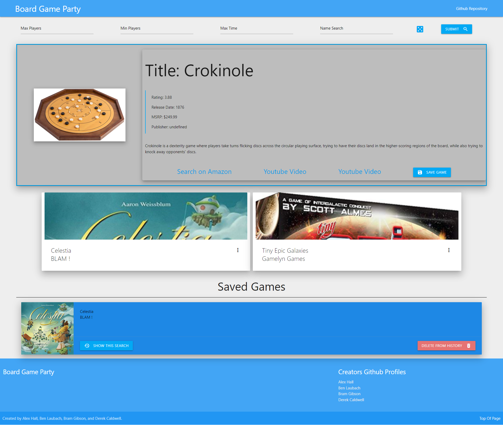

# Board Game Party

## Description

This application is a website that allows you to generate board games based off of some search requirements. This project was built as a group so that we could have an easy way to generate new board games that we may not have heard of before, and solves the problem of not having anything ready for group gatherings. All four of us learned quite a bit about the collaborative github workflow, and working through the challenges of working as a group.

## Installation

No installation is required. Visit the link of the deployed page [here](https://bram-g.github.io/Board-Game-Party/).

## Usage

To use this tool, enter search information for any type of game that you would like, and click the 'search' button. Alternatively, the dice can be clicked to retrieve three completely random games from the API.

## Credits

API's Used:
- [Board Game Atlas API Docs](https://www.boardgameatlas.com/api/docs)
- [YouTube API Docs](https://developers.google.com/youtube/v3)

Collaborators:
- [Alex Hall](https://github.com/alexh3422)
- [Ben Laubach](https://github.com/blaubachs)
- [Bram Gibson](https://github.com/Bram-G)
- [Derek Caldwell](https://github.com/CaldwellDerek)

## Features

Features that the generator includes:

- Generate a board game based off of:
    - Amount of players.
    - Name.
    - Playtime.

- Extra games are generated in cards below the top card.

- Games will list the following information on the main card: 
    - Title.
    - Image provided from API.
    - Player ratings.
    - Release date.
    - MSRP price.
    - Publisher.
    - Description.
    - Amazon search link.
    - Two related YouTube videos.

- Extra cards generated below will have the following information:
    - Title
    - Image provided from API.
    - MSRP.
    - Playtime.

- The user will have the ability to save any of the games generated to local storage.
    - These cards can be deleted with the "delete from history" button.

- All saved games, or extra games generated in cards, have the ability to be searched with the "show this search" button.
