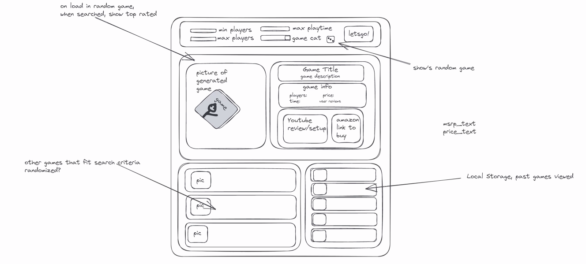

# Board-Game-Party
Uses multiple API's to search a board game database and then shows a link on where to buy the game.

## New Tech

- Materialize
- Board Game Atlas API
- Youtube API

## Elevator Pitch

Have you ever had guests over, family or friends, and have had that awkward experience where nobody knows what to do because you had nothing planned?

Well, worry no more!
With our new application: Board Game Party, you will be able to do at the very BARE minimum the following!

- Generate random board games based on the following criteria:
    - Pick a minimum amount of players!
    - Filter by playtime and price!
    - Game category!
    - MAYBE other filters too!
- See reviews for board games!
- Watch related YouTube for board games!

Never again fear for a boring event that you host for your loved ones! 

*Coming soon!*

### Role Breakdown

- Bram: UI/UX
- Alex: API Research/Information
- Derek: JavaScript and logic
- Ben: JavaScript and logic

## Wireframe and Features

- Form on top, this will have a combination of dropdowns and inputs to get information from user.
- Section underneath will have a picture of generated game and title, description, info like price and user reviews. 
- Use the YouTube API to pull in related videos.
- Two sections below the main game (potential future feature to sort this by top rated depending on user input)
    - Section on the left will give us extra recommendations
    - Section on the right will give us past searched games.

## Potential Future Features

*Features for future development after the minimum viable product milestone is reached. This will be decided on as we evaluate progress for the application.*

- Landing page.
- Separate page for locally stored games.
- General UI improvements.
- Ability to sort by completely random or top rated for recommended games.

## Naming Convention

- Game API Naming
    - gameTypeTag
        - Type is Search, Random, Input
        - These will be used for each respective type of element.
- YouTube API Naming TBD

## Potential Issues

- Probably just contruct an amazon link.
- Try to include a link to buy or construct an amazon link to a search result.